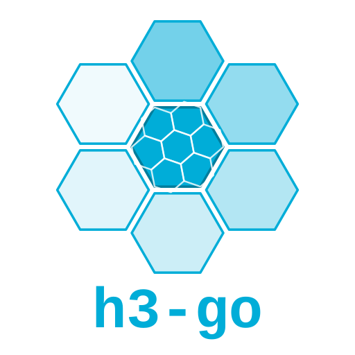

# h3-go

[](https://github.com/dimchansky/h3-go/actions/workflows/ci.yml)
[](https://github.com/dimchansky/h3-go/actions/workflows/nightly.yml)
[](https://pkg.go.dev/github.com/dimchansky/h3-go)
[](docs/comparison-uber-h3-go.md#versions-compared)
[](https://github.com/dimchansky/h3-go/tags)
[](LICENSE)

A **pure-Go** implementation of [Uber's H3](https://h3geo.org), the
hexagonal hierarchical geospatial indexing system. All **78 public
functions of H3 C v4.4.0** behind a typed, allocation-aware Go API, plus a
drop-in pure-Go port of the upstream `h3` command-line utility — **no cgo,
no `unsafe`, no dependencies**, with every ported function parity-tested
against the original C implementation.

[Install](#install) · [Quick start](#quick-start) ·
[API map](docs/api-map.md) ·
[Migration from uber/h3-go](docs/migration-from-uber-h3-go.md) ·
[Benchmarks](docs/benchmarks/results.md) ·
[CLI](#the-h3-command-line-utility) · [Docs](docs/README.md)

## Install

```sh
go get github.com/dimchansky/h3-go
```

Requires Go ≥ 1.24 (CI tests the oldest supported and the latest stable
Go versions). Nothing else: no C toolchain, no environment setup. `CGO_ENABLED=0` builds,
cross-compilation, static binaries, and scratch containers all just work.

## Quick start

A complete, runnable program:

```go
package main

import (
	"errors"
	"fmt"

	h3 "github.com/dimchansky/h3-go"
)

func main() {
	// Index a coordinate. Coordinates are Angle-typed, so degree/radian
	// mix-ups don't compile.
	cell, err := h3.LatLngToCell(h3.LatLngDegs(37.7759, -122.4180), 9)
	if err != nil {
		panic(err)
	}
	fmt.Println(cell) // 8928308280fffff

	// Hierarchy and traversal.
	parent, _ := cell.Parent(5)
	children, _ := parent.Children(9)
	disk, _ := cell.GridDisk(2)           // cell + everything within 2 rings
	fmt.Println(len(children), len(disk)) // 2401 19

	// Validated parsing and sentinel errors.
	if _, err := h3.ParseCell("not-a-cell"); err != nil {
		fmt.Println(err) // h3: invalid index string "not-a-cell": ...
	}
	if _, err := cell.GridDiskUnsafe(2); errors.Is(err, h3.ErrPentagon) {
		// fall back to the safe variant
	}

	// Regions.
	polygon := h3.GeoPolygon{GeoLoop: h3.GeoLoop{
		h3.LatLngDegs(37.813, -122.408),
		h3.LatLngDegs(37.708, -122.390),
		h3.LatLngDegs(37.784, -122.511),
	}}
	cells, _ := h3.PolygonToCells(polygon, 7)
	fmt.Println(len(cells)) // 9
}
```

More runnable examples are in [example_test.go](example_test.go) and on
[pkg.go.dev](https://pkg.go.dev/github.com/dimchansky/h3-go).

## Why h3-go

The official Go option, [uber/h3-go](https://github.com/uber/h3-go), is a
mature cgo binding around the C library. The practical differences — each
backed by the [full comparison](docs/comparison-uber-h3-go.md) and
[measured, equivalence-gated benchmarks](docs/benchmarks/README.md):

- **No cgo, anywhere.** `CGO_ENABLED=0` builds work everywhere Go runs; CI
  needs no C toolchain. Production code contains no `unsafe` and no
  dependencies — hard invariants checked by CI gates on every build mode.
- **Same behavior, verified.** A 227-file parity suite compares Go against
  the *original* upstream C in-process; differential suites cross-check
  against uber/h3-go itself on identical inputs
  ([details](#correctness-and-testing)).
- **More of H3 4.4 exposed.** All 78/78 public functions, including
  `ConstructCell` and single-origin `Cell.GridDiskUnsafe`, which the
  binding lacks at the same H3 version — plus the
  [Go-native additions below](#beyond-the-c-api).
- **Allocation control the binding cannot offer.** Caller-owned `Append*`
  buffers and streaming iterators; all memory is Go memory, visible to the
  profiler and the GC. The binding also allocates on the C heap, which Go
  tooling [cannot see](docs/benchmarks/README.md#memory-what-bop-can-and-cannot-see).
- **A typed API that catches mistakes at compile time.** `Angle`-typed
  coordinates, validated parsing instead of silent zero indexes, and
  `errors.Is` sentinels mirroring the C error codes.

The trade-offs, equally explicit: this is **v0.x** (pre-1.0 breaking
changes remain possible) while the binding's v4 line has years of
production maturity; the binding **tracks new H3 releases sooner** (it is
on H3 4.5.0 today, this library on 4.4.0); **pure Go is not automatically
faster** — the [benchmarks](#performance) show both directions honestly;
and migrating is a real, if mostly mechanical, change — the
[migration guide](docs/migration-from-uber-h3-go.md) maps every API.

If you need exact lockstep with the newest C release or maximum ecosystem
maturity, the official binding remains a good choice. If you want H3
behavior with Go's build story, memory model, and type system, that is
what this library is for.

## API at a glance

If you know the H3 C API, you already know this one:

| H3 C API | Go API |
|---|---|
| `latLngToCell` | `LatLngToCell`, `LatLng.Cell` |
| `cellToLatLng` / `cellToBoundary` | `Cell.LatLng` / `Cell.Boundary` |
| `cellToParent` / `cellToChildren` | `Cell.Parent` / `Cell.Children` |
| `gridDisk` / `gridDistance` | `Cell.GridDisk` / `Cell.GridDistance` |
| `compactCells` / `uncompactCells` | `CompactCells` / `UncompactCells` |
| `cellsToDirectedEdge` | `Cell.DirectedEdgeTo` |
| `cellToVertexes` | `Cell.Vertexes` |
| `polygonToCells` | `PolygonToCells` |
| `greatCircleDistanceKm` | `GreatCircleDistanceKm` |

The complete generated map of all **78** functions — grouped by category,
with the additive `Append*`/`*Seq` forms — is
**[docs/api-map.md](docs/api-map.md)**.

## Beyond the C API

Go-native capabilities with no C equivalent:

| Capability | Representative API |
|---|---|
| Streaming iterators | `Cell.ChildrenSeq`, `CellsAtRes`, `PolygonToCellsExperimentalSeq` — nothing materialized |
| Caller-owned buffers | `Cell.AppendGridDisk`, `Cell.AppendChildren`, `AppendUncompactCells`, and the other `Append*` forms; several reach 0 allocs with a warm buffer (algorithms needing scratch space still allocate internally) |
| Typed coordinates | `Angle`, `Deg`, `Rad`, `LatLngDegs` — degree/radian mix-ups don't compile |
| Typed, validated indexes | `Cell`, `DirectedEdge`, `Vertex` with `ParseCell`/`ParseDirectedEdge`/`ParseVertex` and JSON-ready text marshaling |
| Exact sizing helpers | `MaxGridDiskSize`, `Cell.NumChildren`, `UncompactCellsSize`, … for pre-allocation |
| Grouped distance rings | `Cell.GridDiskDistancesGrouped` |
| Pure-Go CLI | [`cmd/h3`](cmd/h3) |

```go
buf := make([]h3.Cell, 0, 64)
disk, _ := cell.AppendGridDisk(buf[:0], 2) // 0 allocs when capacity suffices

for child := range cell.ChildrenSeq(12) {  // streams, nothing materialized
    _ = child
}
```

## The `h3` command-line utility

A pure-Go, dependency-free replacement for the upstream C `h3` executable —
same commands, same flags, same output formats, same exit codes:

```sh
go install github.com/dimchansky/h3-go/cmd/h3@latest
```

```sh
h3 latLngToCell -r 9 --lat 37.7759 --lng -122.4180
# "8928308280fffff"

h3 cellToBoundary -c 8928308280fffff -f wkt
# POLYGON((-122.4171997184 37.7751977829, ...))

printf '[[37.775, -122.418], [40.689, -74.044]]' | h3 greatCircleDistanceKm -i --
# 4126.3699216676
```

All 63 H3 C v4.5.0 commands are implemented and locked by the 172 upstream
CLI test scenarios plus differential runs against the compiled C binary.
See [cmd/h3](cmd/h3) and the
[compatibility contract](docs/cli-compatibility.md). Prebuilt,
bit-reproducible archives for six OS/architecture targets (with
`SHA256SUMS`) are published on
[GitHub Releases](https://github.com/dimchansky/h3-go/releases), built and
verified by the
[release-builds workflow](.github/workflows/release-builds.yml).

## Compatibility and versioning

- **Upstream**: behaviorally equivalent to **H3 C v4.4.0**
  (`VersionMajor/Minor/Patch` report the target release). Intentional
  differences are few and all documented in
  [docs/DEVIATIONS.md](docs/DEVIATIONS.md); everything else must match C
  exactly, and the parity suite enforces it. New upstream releases are
  adopted through a documented, tooling-assisted
  [sync workflow](docs/public-api-architecture.md#10-upstream-synchronization-workflow).
- **Maturity**: v0.x — the API is complete and heavily exercised, but
  pre-1.0 breaking changes remain possible and are documented in the
  [CHANGELOG](CHANGELOG.md). The pre-v1.0.0 checklist lives in
  [docs/FUTURE_WORK.md](docs/FUTURE_WORK.md).
- **Versioning**: the module version (the Git tag) and the H3 Core target
  are independent axes — tags are plain SemVer and never encode the H3
  version. The full policy is [docs/versioning.md](docs/versioning.md).
- **Go**: from the [go.mod](go.mod) version up to the latest stable
  release (CI tests both ends).

## Performance

Performance is operation- and platform-specific. This pure-Go
implementation avoids cgo-call overhead and offers reusable-buffer APIs;
the official C core is faster for some heavier geometry operations. The
comparison against **uber/h3-go v4.4.1** covers 33 scenarios with identical
deterministic inputs, semantic-equivalence gates, 10 repetitions, and
`benchstat` summaries.

<!-- BEGIN GENERATED: benchdocs README (run `make gen-benchdocs`) -->

The complete report covers **all 33 scenarios**; this scorecard counts the
statistically faster implementation for each execution-time result.

| Environment | this library faster | uber/h3-go faster | no clear difference |
|---|---:|---:|---:|
| Apple M1 Max · `darwin/arm64` | **12** | **20** | 1 |
| GitHub Actions AMD EPYC 7763 · `linux/amd64` | **26** | **5** | 2 |

**[Explore every scenario, timing, allocation, process-memory, and reusable-buffer result →](docs/benchmarks/results.md)**

Several outcomes reverse between the two environments. That is a measured
platform difference, not evidence that either implementation is universally
faster; absolute timings must not be compared across machines.
<!-- END GENERATED: benchdocs README -->

Caveats that matter: Go's `B/op` cannot see the binding's C-heap
allocations, and Linux/amd64 results come from a shared CI runner with
wider noise. The [full results](docs/benchmarks/results.md) include
confidence intervals, allocation comparisons, process-memory workloads,
and interpretation guidance; the
[methodology guide](docs/benchmarks/README.md) shows how to reproduce the
suite.

## Correctness and testing

Correctness is enforced in layers; each answers a different question:

- **C parity** — 227 opt-in cgo test files compile the pristine upstream C
  sources and compare every ported function against the original
  in-process: exact values, exact error codes.
- **Upstream tests, ported** — H3's own test suites translated to Go and
  tracked case-by-case ([docs/ported-c-tests.md](docs/ported-c-tests.md)).
- **Fixtures and fuzzing** — 526,546 golden upstream records replayed
  nightly and on every release tag, plus seven fuzz targets covering all
  upstream fuzzer input domains.
- **Differential vs the official binding** —
  [interop/uberdiff](interop/uberdiff) and the benchmark suite's
  equivalence gates run both implementations on identical inputs.
- **CLI compatibility** — all 172 upstream CLI scenarios, plus differential
  execution against the compiled upstream `h3` binary.
- **Allocation assertions** — `testing.AllocsPerRun` tests lock allocation
  budgets, including the zero-allocation guarantees of the warm paths that
  promise them, so the claims [above](#beyond-the-c-api) are enforced, not
  aspirational.
- **Structural gates** — no `unsafe` reachable from any normal build, C-API
  completeness, a locked API surface
  ([docs/api-surface.txt](docs/api-surface.txt)), and inventory drift
  gates.

The pure-Go test suite (`make test`) needs nothing but Go; only the parity
and differential suites require a C toolchain, and they are strictly
opt-in. [docs/ci-policy.md](docs/ci-policy.md) explains which layer runs
when in CI.

## Documentation

- **Library user** → [quick start](#quick-start) →
  [pkg.go.dev reference](https://pkg.go.dev/github.com/dimchansky/h3-go) →
  [C→Go API map](docs/api-map.md) →
  [intentional deviations from C](docs/DEVIATIONS.md).
- **Migrating from uber/h3-go** →
  [migration guide](docs/migration-from-uber-h3-go.md) →
  [full comparison](docs/comparison-uber-h3-go.md).
- **CLI user** → [cmd/h3 README](cmd/h3/README.md) →
  [compatibility contract](docs/cli-compatibility.md).
- **Contributor or maintainer** → [CONTRIBUTING.md](CONTRIBUTING.md) →
  [architecture & decision records](docs/public-api-architecture.md) →
  [AGENTS.md](AGENTS.md) quick reference.

The full annotated index — including the repository map and every
generated inventory — is [docs/README.md](docs/README.md).

## Contributing, security, and license

Contributions are welcome. `make test` runs the pure-Go suite with no
setup beyond Go itself, and
`make fmt lint test check-unsafe check-layout check-docs` covers the
routine local checks (CI runs more: C parity plus API, test, and CLI
inventory gates). The CI-enforced ground rules, the full command list,
and the upstream-sync workflow are in [CONTRIBUTING.md](CONTRIBUTING.md).

- Bugs and questions → [GitHub issues](https://github.com/dimchansky/h3-go/issues)
- Vulnerability reports → [SECURITY.md](SECURITY.md)
- License → Apache-2.0 ([LICENSE](LICENSE)). This project reimplements
  algorithms from [Uber's H3](https://github.com/uber/h3); see
  [NOTICE](NOTICE) for attribution.
